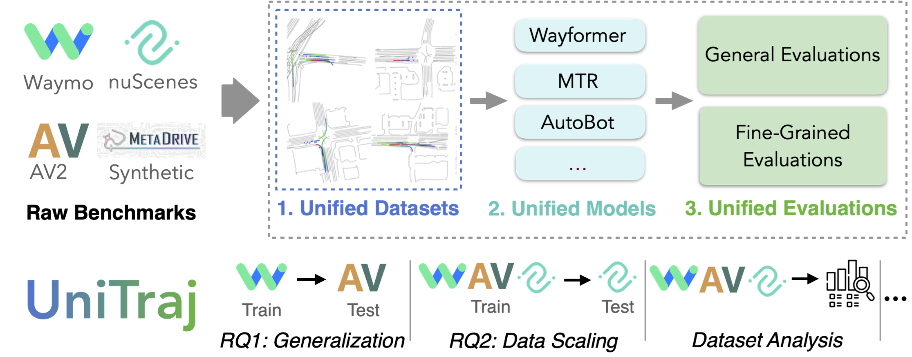

# UniTraj
[](https://paperswithcode.com/sota/trajectory-prediction-on-nuscenes?p=unitraj-a-unified-framework-for-scalable)

[**Code**](https://github.com/vita-epfl/UniTraj) |
[**Paper**](https://arxiv.org/pdf/2403.15098.pdf)

**A Unified Framework for Scalable Vehicle Trajectory Prediction**

💡UniTraj allows users to train and evaluate trajectory prediction models from real-world datasets like Waymo, nuPlan, 
nuScenes and Argoverse2 in a unified pipeline. 



🔥Powered by [Hydra](https://hydra.cc/docs/intro/), [Pytorch-lightinig](https://lightning.ai/docs/pytorch/stable/), and [WandB](https://wandb.ai/site), the framework is easy to configure, train and log.


## 🛠 Quick Start
0. Create a new conda environment
```bash
conda create -n unitraj python=3.9
conda activate unitraj
```
1. Install ScenarioNet: https://scenarionet.readthedocs.io/en/latest/install.html

2. Install Unitraj:
```bash
git clone https://github.com/vita-epfl/UniTraj.git
cd unitraj
pip install -r requirements.txt
python setup.py develop
```

You can verify the installation of UniTraj via running the training script:
```bash
python train.py method=autobot
```
The model will be trained on several sample data.

## Code Structure
There are three main components in UniTraj: dataset, model and config.
The structure of the code is as follows:
```
unitraj
├── configs
│   ├── config.yaml
│   ├── method
│   │   ├── autobot.yaml
│   │   ├── MTR.yaml
│   │   ├── wayformer.yaml
├── datasets
│   ├── base_dataset.py
│   ├── autobot_dataset.py
│   ├── wayformer_dataset.py
│   ├── MTR_dataset.py
├── models
│   ├── autobot
│   ├── mtr
│   ├── wayformer
│   ├── base_model
├── utils
```
There is a base config, dataset and model class, and each model has its own config, dataset and model class that inherit from the base class.

## Pipeline
### 1. Data Preparation
UniTraj takes data from [ScenarioNet](https://github.com/metadriverse/scenarionet) as input. Process the data with ScenarioNet in advance.

### 2. Configuration
UniTraj uses [Hydra](https://hydra.cc/docs/intro/) to manage configuration files.

Universal configuration file is located in `unitraj/config/config.yaml`.
Each model has its own configuration file in `unitraj/config/method/`, for example, `unitraj/config/method/autobot.yaml`.

The configuration file is organized in a hierarchical structure, and the configuration of the model is inherited from the universal configuration file.

#### Configuration Example
Please refer to config.yaml and method/autobot.yaml for more details.

### 2. Train
```python train.py```

### 3. Evaluation
1. In config.yaml, set the `ckpt_path` to the path of the trained model and `val_data_path` to the validation data path.
2. (Optional) In config.yaml, set eval_waymo or eval_nuscenes to True if you want to evaluate the model with Waymo or nuScenes official evaluation tool. (Install waymo-open-dataset and nuscenes-devkit first)
3. Run```python evaluation.py```

### 4. Dataset Analysis
```python data_analysis.py```


## Contribute to UniTraj
### Implement a new model
1. Create a new config file in `unitraj/config/` folder, for example, `unitraj/config/new_model.yaml`
2. (Optional) Create a new dataset class in `unitraj/datasets/` folder, for example, `unitraj/datasets/new_dataset.py`, and inherit `unitraj/dataset/base_dataset.py`
2. Create a new model class in `unitraj/model/` folder, for example, `unitraj/model/lanegcn.py`, and inherit from pl.LightningModule

### Batch Data Format
The default batch data format is: 

For trajectory input:
``obj_trajs [num_centered_obj, num_surrounding_objs, past_time_steps, num_attribute]
``

``
[0:3] position (x, y, z)  
[3:6] size (l, w, h)
[6:11] type_onehot
[11:23] time_onehot
[23:35] heading_encoding
[25:37] vx,vy
[27:39] ax,ay
``

For map input:
``
map_polylines [num_centered_obj, num_surrounding_lines, max_points_per_lane, num_attribute=9]
``

``
[0:3] position (x, y, z)  
[3:6] direction (x, y, z)
[6] type
[7:9] previous_point_xy 
``

[//]: # (## Training on RCP)

[//]: # (0. Install runAI CLI and Kubernetes: https://wiki.rcp.epfl.ch/home/CaaS/Quick_Start)

[//]: # (1. Update the unitraj/run_rcp/wandb-secret.yaml according to the instruction: https://wiki.rcp.epfl.ch/en/home/CaaS/how-to-use-secret )

[//]: # (2. Clone the repo to RCP server, and modify the config file)

[//]: # (3. Modify the unitraj/run_rcp/train.yaml, especially configs related to file path, username, etc.)

[//]: # (3. Run the following command to train on RCP server)

[//]: # (```kubectl create -f train.yaml```)

---

### For citation:
```
@article{feng2024unitraj,
  title={UniTraj: A Unified Framework for Scalable Vehicle Trajectory Prediction},
  author={Feng, Lan and Bahari, Mohammadhossein and Amor, Kaouther Messaoud Ben and Zablocki, {\'E}loi and Cord, Matthieu and Alahi, Alexandre},
  journal={arXiv preprint arXiv:2403.15098},
  year={2024}
}

